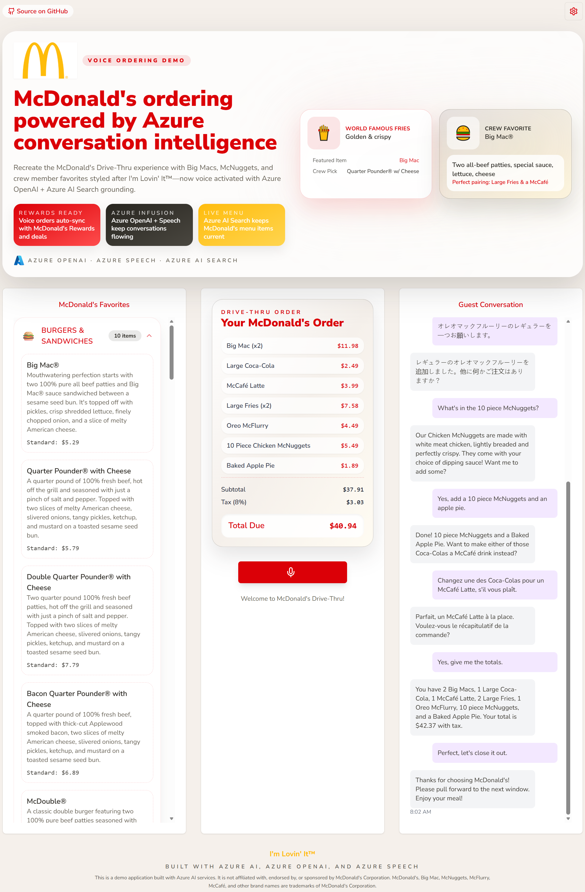
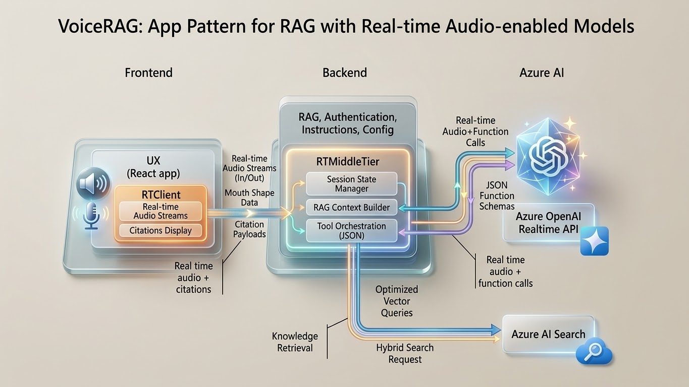

> **Disclaimer:** This is a demo/sample application built with Azure AI services for educational purposes. It is not affiliated with, endorsed by, or sponsored by McDonald's Corporation.

# McDonald's AI Drive-Thru

McDonald's AI Drive-Thru is a McDonald's–themed, voice-driven ordering experience that showcases Microsoft best practices for Azure OpenAI GPT-4o Realtime, Azure AI Search, and Azure Container Apps. The experience emulates a McDonald's crew member who can search the official menu, hold multilingual conversations, and keep orders in sync across devices.

As guests speak, real-time transcription, translation, and order management provide a transparent view of every choice...from shakes and fries to burgers and McNuggets. The UI applies McDonald's vibrant design language so stakeholders can picture how voice AI augments drive-thru, crew member, and kiosk flows.

Beyond the drive-thru experience, this sample demonstrates how Microsoft’s Responsible AI guidance plus Azure-first tooling enable inclusive, hands-free interactions for franchise teams, accessibility scenarios, and mixed fleet deployments across the McDonald's restaurant network.

## Table of Contents

- [McDonald's AI Drive-Thru](#mcdonalds-ai-drive-thru)
  - [Table of Contents](#table-of-contents)
  - [Acknowledgment](#acknowledgment)
  - [Visual Demonstrations](#visual-demonstrations)
    - [Desktop 4 Minute Interaction Big Order Demo](#desktop-4-minute-interaction-big-order-demo)
    - [Mobile Multilingual Ordering Demo](#mobile-multilingual-ordering-demo)
    - [UI Elements Walkthrough](#ui-elements-walkthrough)
  - [Features](#features)
    - [Core AI & Voice Experience](#core-ai--voice-experience)
    - [Audio Intelligence & Stability](#audio-intelligence--stability)
    - [Smart Order Intelligence](#smart-order-intelligence)
    - [Search & Performance Optimization](#search--performance-optimization)
    - [Retrieval-Augmented Generation (RAG)](#retrieval-augmented-generation-rag)
    - [Real-Time Order Display](#real-time-order-display)
    - [UI Features](#ui-features)
    - [Observability & Diagnostics](#observability--diagnostics)
    - [Real-Time Transcription + Translation](#real-time-transcription--translation)
    - [Audio Output + Accessibility](#audio-output--accessibility)
  - [Agentic Architecture Flow](#agentic-architecture-flow)
    - [How It All Works — End-to-End Flow](#how-it-all-works--end-to-end-flow)
    - [Architecture Diagram](#architecture-diagram)
    - [Technical Stack](#technical-stack)
  - [Getting Started](#getting-started)
    - [GitHub Codespaces](#github-codespaces)
    - [VS Code Dev Containers](#vs-code-dev-containers)
    - [Local environment](#local-environment)
  - [Ingesting Menu Items into Azure AI Search](#ingesting-menu-items-into-azure-ai-search)
    - [From JSON](#from-json)
      - [Steps (JSON)](#steps-json)
    - [From PDF](#from-pdf)
      - [Steps (PDF)](#steps-pdf)
  - [Running the App Locally](#running-the-app-locally)
    - [Option 1: Direct Local Execution (Recommended for Development)](#option-1-direct-local-execution-recommended-for-development)
    - [Option 2: Docker-based Local Execution](#option-2-docker-based-local-execution)
  - [Deploying to Azure](#deploying-to-azure)
  - [🍔 Built with Squad](#-built-with-squad)
  - [Contributing](#contributing)
  - [Resources](#resources)

## Acknowledgment

This project extends the [VoiceRAG Repository](https://github.com/Azure-Samples/aisearch-openai-rag-audio), adapting its Microsoft-first architecture for a McDonald's Drive-Thru scenario. Review the original pattern in this [blog post](https://aka.ms/voicerag). For the upstream README, see [voice_rag_README.md](voice_rag_README.md).

Special thanks to [John Carroll](https://github.com/john-carroll-sw) for the original [coffee-chat-voice-assistant](https://github.com/john-carroll-sw/coffee-chat-voice-assistant) that inspired this sample. This fork updates to the latest OpenAI models and adds a McDonald's Drive-Thru twist to the solution.

## Visual Demonstrations



## Features

### Core AI & Voice Experience
- **Azure OpenAI GPT-4o Realtime API**: Voice-to-voice ordering powered by gpt-realtime-1.5 with optimized system prompt (bulleted format, ALL CAPS emphasis, variety rules to prevent robotic repetition).
- **McDonald's crew member personality**: Upbeat, friendly, branded — **Nova voice** (warm, friendly female) embodies the McDonald's crew member persona. Phrase variety rules prevent bot-like repetition ("Awesome choice!", "You got it!", "Great pick!", "Coming right up!").
- **Natural turn-taking**: Server VAD tuning (threshold 0.7, prefix padding 300ms, silence duration 500ms) for seamless back-and-forth conversations.
- **Spoken currency**: "Four dollars and nineteen cents" instead of "$4.19" — more natural, more McDonald's.
- **Temperature 0.6**: Optimized balance of deterministic tool calling and natural conversational variance (Azure OpenAI Realtime API minimum).
- **Active listening**: Conversational acknowledgments confirm each guest request ("No tartar sauce, you got it!").
- **Anti-self-talk**: AI NEVER speaks unless the guest has spoken first — imperative greeting prompt prevents startup meta-commentary.

### Audio Intelligence & Stability
- **Echo suppression (defense-in-depth)**: Server-side audio gating in rtmt.py (`ai_speaking` flag + 1.5s cooldown + delayed `input_audio_buffer.clear`) plus frontend mic muting via gain node at `response.created`. Extended 3.0s cooldown after greeting audio.
- **Barge-in detection**: `AnalyserNode` on the raw mic stream monitors RMS energy in real-time. When the guest interrupts, `response.cancel` stops the AI mid-sentence and `speech_started` overrides echo suppression — natural conversation flow preserved.
- **Anti-feedback loop**: Multi-layered approach — VAD threshold 0.7, silence duration 500ms, auto gain control disabled, recorder worklet isolation via gain node, mic muting during AI playback.

### Smart Order Intelligence
- **Tool-calling orchestration**: Four tools drive the ordering flow — `search` (menu lookup), `update_order` (add/remove items), `get_order` (retrieve current order), `reset_order` (clear the ticket).
- **Combo validation with SYSTEM HINT**: `get_combo_requirements()` deterministically tracks missing sides and drinks, injecting `[SYSTEM HINT]` into tool results to guide the AI without relying on LLM memory.
- **Combo pivot absorption**: When a combo is added, standalone sides and drinks already on the ticket are automatically absorbed into the combo — no duplicate asks. Multi-quantity items are decremented rather than fully removed.
- **Combo conversion & upselling**: AI asks "Want to make that a combo with fries and a drink?" for solo burgers/sandwiches. Fries-first branding (McDonald's World Famous Fries always suggested as the go-to side). McDonald's signature treat suggestions when the order has no dessert.
- **Item customizations**: Guests can request modifications like "no lettuce", "extra ketchup", or "plain." Mods are parsed, displayed on the order ticket, and read back naturally ("with no lettuce, extra ketchup").
- **Invalid mod rejection**: Nonsensical modifications are caught and redirected with friendly crew member humor — mustard on a shake, cheese on a shake, or whipped cream on a burger get a warm redirect ("That's a new one! Want to try a different topping?").
- **Quantity limits**: Max 10 per item, 25 total with friendly crew member-style responses ("Whoa, that's a lot of fries!").
- **Happy Hour dynamic pricing**: Drinks and shakes are 50% off from 2:00–4:00 PM local time. Original prices preserved; discounts applied at summary level. AI gets excited about the deal in context.
- **OOS machine status**: Ice cream machine down → McFlurry/shake/sundae items flagged `[OOS]` in search results with alternative suggestions. Non-blocking — items still returned, just flagged. Module-level toggle for demo use.
- **Size normalization**: Various shorthand size references normalize to standard McDonald's sizing in the order.
- **Mandatory total re-read**: After any order change, the AI re-reads the complete order total so the guest always knows where they stand.
- **Grouped readback**: "Two Medium Coca-Colas and one McNuggets" instead of listing every item individually — faster, more natural.
- **Delta summaries**: Natural voice deltas for the AI to speak, full JSON for screen display (`TO_BOTH` routing).
- **Price validation**: Rejects $0 items with friendly retry messages — catches model hallucination when it skips search.
- **8% sales tax**: Hardcoded tax rate applied to all orders, displayed on the order ticket.

### Search & Performance Optimization
- **Azure AI Search for menu RAG**: 172 items indexed from sample McDonald's menu data (`mcdonalds-menu-items.json`) with semantic hybrid search (text-embedding-3-large, 3072 dimensions).
- **TTL search cache**: 60-second, 128-entry cache for Azure AI Search results eliminates redundant queries.
- **Human-readable sizes**: "Small ($2.49), Medium ($3.29)" instead of raw JSON in tool results.
- **Gzip compression**: 60–70% reduction on HTTP responses for mobile-first experience.
- **Strategic vendor chunking**: Optimized frontend bundle splitting in Vite with explicit groups (react-vendor, ui-vendor, i18n, motion).
- **Lazy-loaded Settings**: `React.lazy()` + `Suspense` for the Settings panel — faster initial page load.

### Retrieval-Augmented Generation (RAG)
- **Grounded recommendations**: Azure OpenAI tool-calling plus semantic hybrid search keep menu suggestions grounded with pricing, sizes, and add-on guidance — zero hallucinated items. Explicit grounding rule: "ONLY recommend items found in search results."
- **[SYSTEM HINT] pattern**: Deterministic Python logic drives conversation direction, not LLM memory. Tools return both voice-friendly text for the AI and JSON metadata for the frontend.

### Real-Time Order Display
- **"Your McDonald's Order" order ticket**: Live-updating order panel shows every item, customization, size, quantity, subtotal, tax, and total as the guest speaks — the real-time equivalent of a drive-thru order ticket.
- **Live synchronization**: Function calls update the shared cart so drive-thru screens, mobile devices, and crew member tablets stay aligned without race conditions.

### UI Features
- **50 menu items**: 10 items per category across 5 collapsible categories (Burgers & Sandwiches, Chicken & McNuggets, Shakes & Drinks, McCafé & Ice Cream, Extras & Sides) — all expanded by default. Menu synced with the Azure AI Search demo index.
- **Collapsible session token panel**: Shows round-trip token history with per-turn identifiers for debugging and QA.
- **Settings panel**: Verbose Logging toggle, Log to File toggle (sub-option of Verbose Logging), and Show Session Tokens toggle.
- **Dark mode support**: Full dark/light theme switching.
- **Responsive design**: Optimized for desktop and mobile viewports.

### Observability & Diagnostics
- **Verbose logging** (`mcdonalds-verbose` logger): Dedicated diagnostic logger separate from the main application logger. Logs every message type, full tool call lifecycle (args, result, direction, execution time), echo suppression state changes, transcriptions, and session lifecycle events. Audio data never logged.
- **File logging**: Timestamped log files written to `app/backend/logs/` (e.g., `verbose-2026-03-22T01-38.log`). UTF-8, line-buffered. Per-session file handlers toggled via UI or `VERBOSE_LOG_FILE` env var.
- **Session token tracking**: Every realtime conversation emits session tokens plus per-turn identifiers so transcripts map back to telemetry, QA findings, or Azure logs.

### Real-Time Transcription + Translation
- **Multilingual ordering**: Guests receive accurate transcripts in their language of choice with instant pivots between English, Spanish, Mandarin, French, and more.

### Audio Output + Accessibility
- **Browser audio playback**: Mirrors what a guest would hear at a McDonald's drive-thru, supporting screenless or low-vision ordering.

## Agentic Architecture Flow


### How It All Works — End-to-End Flow

Imagine a guest pulling up to a McDonald's drive-thru. They tap the mic button on their phone (or press the drive-thru intercom), and from that moment, an entire agentic pipeline fires in real-time. Here's what happens behind the scenes — every step, every decision, every millisecond matters.

---

**1. The Guest Speaks**

> *"I'll take a Big Mac — plain, cheese only — Medium Fries, and a Large Diet Coke. Actually, can I add a McFlurry but… put some pickles in it?"*

The browser's **WebAudio API** captures raw audio from the microphone. An `AnalyserNode` monitors the RMS energy of the raw stream in real-time — this is how the system knows the guest is actually speaking versus picking up ambient drive-thru noise or echo from the AI's own response.

**2. Frontend → Middleware (WebSocket)**

The **React/TypeScript frontend** encodes the captured audio to base64 and streams it over a persistent WebSocket connection to the Python backend. This isn't a request-response cycle — it's a continuous, low-latency stream. The guest's words arrive at the server as fast as they're spoken.

**3. RTMiddleTier — The Agentic Logic Layer**

This is where the intelligence lives. The `RTMiddleTier` (`rtmt.py`) acts as a WebSocket bridge between the browser and Azure OpenAI, but it's far more than a passthrough — it's the orchestration brain:

- **Echo suppression** kicks in immediately: a 1.5-second cooldown window and delayed buffer flush prevent the AI from hearing its own voice bouncing back through the guest's speakers. After the initial greeting, an extended 3.0-second cooldown ensures stability.
- **Barge-in detection** monitors the raw audio stream. If the guest interrupts mid-sentence ("Actually, change that to—"), the system fires `response.cancel` to stop the AI mid-word and lets the guest take the floor. Natural conversation, not robotic turn-taking.
- **Session management** handles the greeting trigger and registers all four tool-calling functions with the Azure OpenAI Realtime API.

**4. Azure OpenAI Realtime API (GPT-4o)**

The audio hits **Azure OpenAI's GPT-4o Realtime API** (`gpt-realtime-1.5`), which processes the guest's speech and decides what to do. It doesn't just transcribe — it *understands intent* and generates both a spoken response and structured **tool calls** as JSON function calls (the "Citation Payloads" shown in the diagram). This is the agentic core: the model autonomously decides which tools to invoke based on the conversation context.

**5. Tool Execution — The Agentic Toolkit**

When the model makes a tool call, the middleware executes it deterministically. Four tools drive the entire ordering flow:

| Tool | What It Does |
|------|-------------|
| `search` | Queries **Azure AI Search** across 172 demo menu items using semantic + vector hybrid search (text-embedding-3-large, 3072 dimensions). Returns human-readable sizes and prices — "Medium ($3.29), Large ($4.19)" — not raw JSON. Results come back with a 60-second TTL cache so repeat lookups are instant. |
| `update_order` | Adds or removes items through the **Stateful Order Manager**. Validates combo integrity (are the side and drink present?), applies customizations, enforces quantity limits (max 10 per item, 25 total), and normalizes sizing. |
| `get_order` | Retrieves the current order as a grouped readback optimized for voice — "Two Medium Coca-Colas and one McNuggets" instead of listing each item individually. Returns both a voice-friendly summary for the AI and full JSON for the order ticket UI. |
| `reset_order` | Clears the entire order and resets the session so the guest can start fresh. |

**6. Order State — The Business Logic Brain**

The **Stateful Order Manager** (`order_state.py`) is where deterministic business rules live — no LLM guesswork allowed:

- **Combo pivot absorption**: When a guest orders a Big Mac Combo, any standalone side or drink already on the ticket gets absorbed into the combo automatically. No awkward "Did you want that as part of the combo?" back-and-forth.
- **Deterministic guardrails**: The `[SYSTEM HINT]` pattern injects combo requirements directly into tool results — "Missing: Drink" — so the AI knows exactly what to ask for next without relying on memory.
- **Promotions engine**: The system checks the clock. If it's **Happy Hour** (2–4 PM Eastern), drinks and shakes get 50% off automatically. The AI gets genuinely excited about the deal.
- **IoT kitchen telemetry**: Machine status flags are checked in real-time. Shake machine down? Every shake, McFlurry, and sundae comes back flagged `[OOS]` with a friendly redirect — *"Our shake machine is taking a quick nap, so I can't do pickles in a shake anyway — but would you like a refreshing drink instead?"*
- **Validation guardrails**: Impossible customizations are caught deterministically. Pickles in a shake? That's a hard no — rejected with warmth and humor, not a stack trace.
- **Tax calculation**: 8% sales tax applied to all demo orders, displayed on the order ticket.

**7. The Response Flows Back**

The response takes three parallel paths back to the guest:

- **Audio** → streams through the WebSocket back to the frontend → plays through the guest's speakers (with echo suppression engaged to prevent feedback loops). The AI's **Nova voice** — warm, friendly, unmistakably McDonald's — delivers the response.
- **Tool results** → the frontend parses JSON payloads and updates the **Order Ticket** in real-time: line items, customizations, combo groupings, subtotals, tax, and the running total. The POS Ticket view shows exactly what would print at the drive-thru.
- **Transcript** → the guest's words and the AI's response appear in the **Guest Conversation** panel with real-time transcription (and translation, if the guest is speaking Spanish, Mandarin, or another supported language).

**8. The Guest Hears and Sees**

The guest hears the AI crew member respond naturally — *"You got it! A plain Big Mac and those Fries and Coke. Our shake machine is taking a quick nap, so I can't do pickles, but would you like a refreshing drink instead?"* — while simultaneously watching their **order ticket update in real-time** on screen. Every item, every mod, every price, every total — all in sync, all instant.

The entire round trip — guest speech → AI understanding → tool execution → business logic → voice response + UI update — happens in **under two seconds**. That's the power of an agentic architecture where deterministic Python guardrails and Azure OpenAI work in concert, not in conflict.

---

> **Note:** This demo uses sample McDonald's menu data (172 items) for demonstration purposes. All prices, promotions, and machine statuses are simulated to showcase the agentic architecture capabilities.

### Architecture Diagram

The `RTClient` in the frontend receives the audio input, sends that to the Python backend which uses an `RTMiddleTier` object to interface with the Azure OpenAI Realtime API, and includes a tool for searching Azure AI Search.



The architecture implements a **WebSocket middle tier** that bridges the browser and Azure OpenAI in real-time, with the backend handling:
- **Audio gating & echo suppression** for stable, interrupt-friendly conversations
- **Tool-calling orchestration**: Menu search, combo validation, order management
- **[SYSTEM HINT] injection**: Deterministic Python logic guides conversation without relying on LLM memory
- **TO_BOTH payloads**: Split responses between voice-friendly text for the AI and JSON metadata for the frontend

### Technical Stack

**Frontend:**
- React, TypeScript, Vite, Tailwind CSS, shadcn/ui
- WebSocket client for real-time audio and order updates
- 50 demo menu items from `menuItems.json` (synced with Azure AI Search index)

**Backend:**
- Python 3.11+ with aiohttp, WebSockets
- WebSocket middle tier (`rtmt.py`) — browser ↔ Azure OpenAI Realtime API
- Azure OpenAI GPT-4o Realtime API (gpt-realtime-1.5)
- Demo menu data from `mcdonalds-menu-items.json` (sample McDonald's menu export, 172 items)

**AI & Search:**
- Azure AI Search with semantic hybrid search (text-embedding-3-large, 3072 dimensions) for menu grounding
- Four tool-calling functions: `search`, `update_order`, `get_order`, `reset_order`

**Infrastructure:**
- Bicep IaC for reproducible deployments
- Azure Container Apps with auto-scaling (20 concurrent requests/replica, max 5 replicas)
- Gunicorn with 2 async workers, 120s timeout, 65s keep-alive
- Docker with layer caching for fast rebuilds
- Health probes: startup (50s), liveness (30s), readiness (10s)
- Azure Developer CLI (`azd`) for one-command provisioning

This repository includes infrastructure as code and a `Dockerfile` to deploy the app to Azure Container Apps, but it can also be run locally as long as Azure AI Search and Azure OpenAI services are configured.

## Getting Started

You have a few options for getting started with this template. The quickest way to get started is [GitHub Codespaces](#github-codespaces), since it will setup all the tools for you, but you can also [set it up locally](#local-environment). You can also use a [VS Code dev container](#vs-code-dev-containers)

### GitHub Codespaces

You can run this repo virtually by using GitHub Codespaces, which opens a web-based VS Code in your browser:

1. In your forked GitHub repository, select **Code ➜ Codespaces ➜ Create codespace on main**.
2. Choose a machine type with at least 8 cores (the 32 GB option provides the smoothest dev experience).
3. After the container finishes provisioning, open a new terminal and proceed to [deploying the app](#deploying-to-azure).

### VS Code Dev Containers

You can run the project in your local VS Code Dev Container using the [Dev Containers extension](https://marketplace.visualstudio.com/items?itemName=ms-vscode-remote.remote-containers):

1. Start Docker Desktop (install it if not already installed).
2. Clone your GitHub repository locally (see [Local environment](#local-environment)).
3. Open the folder in VS Code and choose **Reopen in Container** when prompted (or run the **Dev Containers: Reopen in Container** command).
4. After the container finishes building, open a new terminal and proceed to [deploying the app](#deploying-to-azure).

### Local environment

1. Install the required tools by running the prerequisites script:

  ```bash
  # Make the script executable
  chmod +x ./scripts/install_prerequisites.sh
   
  # Run the script
  ./scripts/install_prerequisites.sh
  ```

  The script installs the Azure CLI, signs you in, and verifies Docker availability for you.

  Alternatively, manually install [Azure Developer CLI](https://aka.ms/azure-dev/install), [Node.js](https://nodejs.org/), [Python >=3.11](https://www.python.org/downloads/), [Git](https://git-scm.com/downloads), and [Docker Desktop](https://www.docker.com/products/docker-desktop).
  2. Clone your GitHub repository (`git clone https://github.com/swigerb/mcdonalds_ai_drivethru.git`)
  3. Proceed to the next section to [deploy the app](#deploying-to-azure).

## Ingesting Menu Items into Azure AI Search

### From JSON

If you have a JSON file containing the menu items for your drive-thru, you can use the provided Jupyter notebook to ingest the data into Azure AI Search.

#### Steps (JSON)

1. Open the `menu_ingestion_search_json.ipynb` notebook.
2. Follow the instructions to configure Azure OpenAI and Azure AI Search services.
3. Prepare the JSON data for ingestion.
4. Upload the prepared data to Azure AI Search.

This notebook demonstrates how to configure Azure OpenAI and Azure AI Search services, prepare the JSON data for ingestion, and upload the data to Azure AI Search for hybrid semantic search capabilities.

[Link to JSON Ingestion Notebook](scripts/menu_ingestion_search_json.ipynb)

### From PDF

If you have a PDF file of a drive-thru's menu that you would like to use, you can use the provided Jupyter notebook to extract text from the PDF, parse it into structured JSON format, and ingest the data into Azure AI Search.

#### Steps (PDF)

1. Open the `menu_ingestion_search_pdf.ipynb` notebook.
2. Follow the instructions to extract text from the PDF using OCR.
3. Parse the extracted text using GPT-4o into structured JSON format.
4. Configure Azure OpenAI and Azure AI Search services.
5. Prepare the parsed data for ingestion.
6. Upload the prepared data to Azure AI Search.

This notebook demonstrates how to extract text from a menu PDF using OCR, parse the extracted text into structured JSON format, configure Azure OpenAI and Azure AI Search services, prepare the parsed data for ingestion, and upload the data to Azure AI Search for hybrid semantic search capabilities.

[Link to PDF Ingestion Notebook](scripts/menu_ingestion_search_pdf.ipynb)

## Running the App Locally

You have two options for running the app locally for development and testing:

### Option 1: Direct Local Execution (Recommended for Development)

Run this app locally using the provided start scripts:

1. Create an `app/backend/.env` file with the necessary environment variables. You can use the provided sample file as a template:

   ```shell
   cp app/backend/.env-sample app/backend/.env
   ```

   Then, fill in the required values in the `app/backend/.env` file.

2. Run this command to start the app:

   Windows:

   ```pwsh
   pwsh .\scripts\start.ps1
   ```

   Linux/Mac:

   ```bash
   ./scripts/start.sh
   ```

3. The app will be available at [http://localhost:8000](http://localhost:8000)

### Option 2: Docker-based Local Execution

For testing in an isolated container environment:

1. Make sure you have an `.env` file in the `app/backend/` directory as described above.

2. Run the Docker build script:

   ```bash
   # Make the script executable
   chmod +x ./scripts/docker-build.sh
   
   # Run the build script
   ./scripts/docker-build.sh
   ```

   This script automatically handles:

    - Verifying/creating frontend environment variables
    - Building the Docker image using `app/frontend/.env` for Vite settings
    - Running the container with your backend configuration

3. Navigate to [http://localhost:8000](http://localhost:8000) to use the application.

Alternatively, you can manually build and run the Docker container:

```bash
# Ensure frontend Vite settings exist (edit values as needed)
# cp ./app/frontend/.env-sample ./app/frontend/.env

# Build the Docker image
docker build -t mcdonalds-drive-thru-app \
  -f ./app/Dockerfile ./app

# Run the container with your environment variables
docker run -p 8000:8000 --env-file ./app/backend/.env mcdonalds-drive-thru-app:latest
```

## Deploying to Azure

To deploy the demo app to Azure:

1. Make sure you have an `.env` file set up in the `app/backend/` directory. You can copy the sample file:

   ```bash
   cp app/backend/.env-sample app/backend/.env
   ```

2. Run the deployment script with minimal parameters:

   ```bash
   # Make the script executable
   chmod +x ./scripts/deploy.sh
   
   # Run the deployment with just the app name (uses all defaults)
   ./scripts/deploy.sh <name-of-your-app>
   ```

   The script will automatically:
   - Look for backend environment variables in `./app/backend/.env`
   - Look for or create frontend environment variables in `./app/frontend/.env`
   - Use the Dockerfile at `./app/Dockerfile`
   - Use the Docker context at `./app`
   
3. For more control, you can specify custom paths:

   ```bash
   ./scripts/deploy.sh \
     --env-file /path/to/custom/backend.env \
     --frontend-env-file /path/to/custom/frontend.env \
     --dockerfile /path/to/custom/Dockerfile \
     --context /path/to/custom/context \
     <name-of-your-app>
   ```

4. After deployment completes, your app will be available at the URL displayed in the console.

## 🍔 Built with Squad

This project was built by an AI development team powered by [**Squad**](https://github.com/bradygaster/squad) — a [GitHub Copilot](https://github.com/features/copilot) agent created by [Brady Gaster](https://github.com/bradygaster) that assembles AI dev teams with persistent memory, shared decision-tracking, and orchestrated workflows.

Here's the best part: **Squad's casting algorithm analyzed this project's context and auto-selected the McDonald's universe for the team.** That's right — an AI drive-thru for McDonald's was built by AI agents named after McDonald's characters. You can't make this stuff up. 🎤⬇️

### 🍟 Meet the Crew

| | Agent | Role | What They Do |
|---|---|---|---|
| 🏗️ | **Ronald** | Lead | Architecture, decisions, code review — sees the whole system, makes the call |
| ⚛️ | **Birdie** | Frontend Dev | React, TypeScript, UI components, audio client, real-time WebSocket integration |
| 🔧 | **Grimace** | Backend Dev | Python, Azure OpenAI Realtime API, WebSockets, AI Search, tool routing |
| 🧪 | **Hamburglar** | Tester | pytest, edge cases, quality gates, performance test harness |
| ⚙️ | **Mayor McCheese** | DevOps | Bicep, Docker, Azure Container Apps, health probes, scaling |
| 🤖 | **Mac Tonight** | AI/Realtime Expert | GPT-4o Realtime tuning, voice AI, system prompts, demo readiness |
| 📋 | **Scribe** | Session Logger | Memory, decisions, orchestration logs — the team's shared brain |

Every architectural decision, performance optimization, and bug fix in this repo was discussed, debated, and implemented by this crew — with a human ([Brian](https://github.com/brswig)) steering the ship. 🚢

> **Want your own AI dev team?** Check out [Squad](https://github.com/bradygaster/squad) and let it cast the perfect crew for your project. Who knows what universe you'll get. 🎲

## License

This project is licensed under the [MIT License](LICENSE). You may use, copy, modify, merge, publish, distribute, sublicense, and/or sell copies of the software, provided that the copyright notice and permission notice from the MIT License are included in all copies or substantial portions of the software. Refer to the [LICENSE](LICENSE) file for the complete terms.

## Contributing

Contributions are welcome! Please review [CONTRIBUTING.md](CONTRIBUTING.md) for environment setup, branching guidance, and the pre-flight test checklist before opening an issue or submitting a pull request.

## Disclaimer

All trademarks and brand references belong to their respective owners.

The diagrams, images, and code samples in this repository are provided **AS IS** for **proof-of-concept and pilot purposes only** and are **not intended for production use**.

These materials are provided without warranty of any kind and **do not constitute an offer, commitment, or support obligation** on the part of Microsoft. Microsoft does not guarantee the accuracy or completeness of any information contained herein.

**MICROSOFT MAKES NO WARRANTIES, EXPRESS OR IMPLIED**, including but not limited to warranties of merchantability, fitness for a particular purpose, or non-infringement.

Use of these materials is at your own risk.

## Resources

- [OpenAI Realtime API Documentation](https://platform.openai.com/docs/guides/realtime)
- [Azure OpenAI Documentation](https://learn.microsoft.com/azure/ai-services/openai/)
- [Azure AI Services Documentation](https://learn.microsoft.com/azure/cognitive-services/)
- [Azure AI Search Documentation](https://learn.microsoft.com/azure/search/)
- [Azure AI Services Tutorials](https://learn.microsoft.com/training/paths/azure-ai-fundamentals/)
- [Azure AI Community Support](https://techcommunity.microsoft.com/t5/azure-ai/ct-p/AzureAI)
- [Azure AI GitHub Samples](https://github.com/Azure-Samples)
- [Azure AI Services API Reference](https://learn.microsoft.com/rest/api/cognitiveservices/)
- [Azure AI Services Pricing](https://azure.microsoft.com/pricing/details/cognitive-services/)
- [Azure Developer CLI Documentation](https://learn.microsoft.com/azure/developer/azure-developer-cli/)
- [Azure Developer CLI GitHub Repository](https://github.com/Azure/azure-dev)
